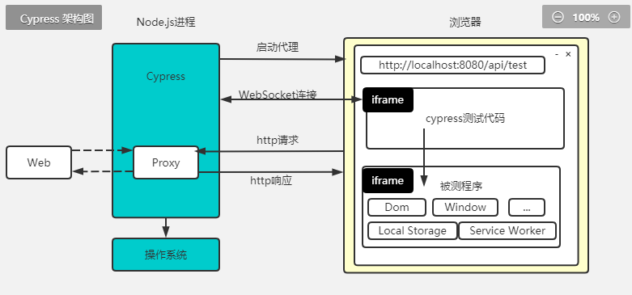
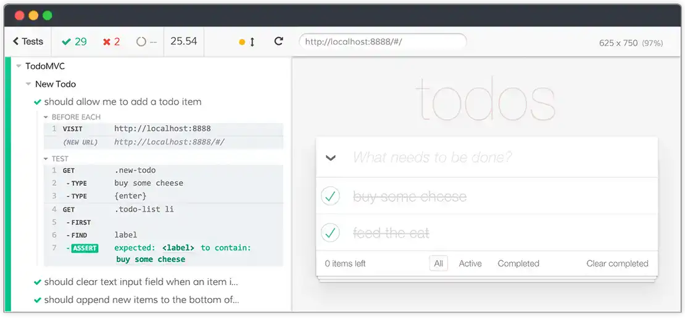
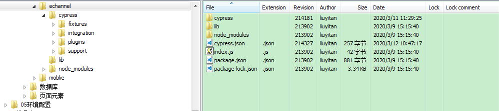

# Cypress 系列之----01 安装和使用

## 一. 简介

　　Cypress是新一代前端测试框架，它基于node js。解决了开发人员和QA工程师在测试现代应用程序时面临的关键难点问题。

　　Cypress包含免费的、开源的、可本地安装的Test Runner 和 能够记录测试的控制面板服务。

*功能特点*

- 【时间旅行】测试的每一步都有 snapshot，只需将鼠标悬停在命令日志中的命令上，就可以准确地查看每个步骤中发生了什么。
- 【实时重新加载】
- 【可调试】　我们无需猜测测试用例为何失败，直接从熟悉的工具进行调试（例如：谷歌浏览器的开发者工具），可读错误和堆栈跟踪让调试更有效率。
- 【自动等待】再也无需在测试用例代码中添加 wait 或 sleep 代码，Cypress 会自动等待命令和断言完成。
- 【函数间谍】响应劫持、时钟回拨：验证和控制函数、服务器响应和时钟（spies，stubs，clock）。常用的单元测试功能。
- 【网络流量控制】无需涉及服务器即可控制、保存和测试边缘情况。你可以根据需要保留网络流量。
- 【视图快照和视频】从命令行运行测试时，我们可以查看失败用例的视图快照和整个测试过程的视频。



参考资料：[官网](https://www.cypress.io/)，[github](https://github.com/cypress-io/cypress)，[API详解参考](https://docs.cypress.io/zh-cn/guides/guides/module-api.html#cypress-run)

## 二. 环境准备

# 系统要求

- macOS 10.9 and above *(64-bit only)*
- Linux Ubuntu 12.04 and above, Fedora 21 and Debian 8 *(64-bit only)*
- Windows 7 and above

如果使用npm安装cypress，支持：

- Node.js 8 and above

### 1 VSCode安装，参考[这里](https://code.visualstudio.com/Download)，直接系统环境下载并安装。

- 格式化代码的快捷键：On Windows Shift + Alt + F
- 插件推荐

### 2 Cypress安装，参考[这里](https://docs.cypress.io/guides/getting-started/installing-cypress.html#Direct-download)

### 3 初识Cypress



- Test status menu（测试状态栏）:从左向右分别显示：成功数、失败数、未运行、耗时，是否自动滚屏和重新运行按钮
- Viewport sizing:（视窗尺寸）：
  - 默认情况下，窗口将为1000*660px，页面左上角会显示；
  - 代码中可用cy.viewport命令指定；
  - 在cypress.json中指定的值也能覆盖默认视口维度。
- Command Log（命令日志）:将鼠标悬停在日志中的某个命令上，将显示测试运行时完整的过程
- App preview（应用用程序预览）：在执行时，实时查看应用程序中发生了什么。使用DevTools检查或调试每个命令。


``` js
describe('My first test case for cypress',function(){
    it('visit baidu home page and search for testerhome:',function(){
        cy.visit('http://www.baidu.com') 　　　　　　　　　　 //访问url
        cy.title().should('contain','百度一下，你就知道')     //验证页面 title 是否正确
        cy.get('#kw')      　　　　　　　　　　　　　　　　　　  //根据 css 定位搜索输入框
         .type('testerhome')        　　　　　　　　　　　　　 //输入关键字
         .should('have.value','testerhome')  　　　　　　　　//验证关键字自动是否展示正确
        cy.get('#su').click()   　　　　　　　　　　　　　　　　//根据 css 定位搜索按钮并点击
        cy.url().should('include','wd=testerhome')     　　//验证目标url 是否正确包含关键字
        cy.title().should('contain','testerhome_百度搜索')  //验证页面 title 是否正确
        cy.get('[id="1"]')   
        .should('contain','TesterHome')   // 验证第一个结果中是否包含TesterHome
        cy.screenshot()
    })
})    
```

代码解释：

- reference表示告诉 VSCode 要去Cypress package 里找相关的语义解析
- describe声明一个测试用例集；
- it声明了一个测试用例，`it.only`只测试这个, `it.skip` 不要测这个；
- beforeEach在每个测试用例运行前需要做的事，before在所有测试用例运行前需要做的事；
- cy.get接受一个 js selector， 就是元素定位字符串（Cypress 也支持 xpath 定位）
- 通过then或should，我们可以把get到的元素对象传递到下一步，以便做进一步处理，这里通过then把找到的button_start_search传递到下一步，

## 三. Cypress使用

### 1. 默认文件组织结构



``` js
cypress_demo
├── cypress # Cypress 工作目录
│   ├── fixtures # 测试用例中要用到的资源，比如：数据库模拟数据、图片、json信息等等，可以使用fixture方法读取
│   │   └── example.json
│   ├── integration # Cypress 脚本测试文件，允许多级目录
│   │   └── examples # 这个文件夹中存放了 Cypress 官方提供的一些测试样例
│   │       ├── actions.spec.js
│   ├── plugins # 存放 Cypress 插件
│   │   └── index.js
│   └── support # 存放 Cypress 自定义命令
│       ├── commands.js
│       └── index.js
├── cypress.json # Cypress 配置文件
└── package.json # 这个要自己创建
```


### 2. 配置文件说明

#### 2.1 Configuration

 [官网说明](https://docs.cypress.io/guides/references/configuration.html#Options)

`baseUrl`：当指定baseUrl配置项后，Cypress会忽略掉 cy.visit() 或 cy.request() 中的url。

当没有baseUrl配置项设定时，Cypress会用localhost加随机端口的方式来先运行，然后遇到 cy.visit() 或 cy.request() 会再变化请求的url，这样会有一点点闪烁或reload的情况。所以指定的baseUrl后，能**节省启动时间**。

`numTestsKeptInMemory`：保存在内存中的快照和命令数据。如果在测试运行期间浏览器内存消耗过大，可以减少此数字

#### 2.2 Node.js Version (12.8.1)

#### 2.3 Proxy Settings

### 3. 运行

3.1 进入 Cypress安装目录\node_modules\bin ，输入
```
\>cypress run
\>cypress run -spec "D:\testProject\CypressProject\node_modules\.bin\cypress\integration\Mytests\pdd. js"

3.2 进入Cypress安装目录，输入
\>yarn run cypress open
\>yarn run cypress run --record --key 401f5c8d-466d-495d-be73-59e315905295

3.3 管理员模式打开 cmd 窗口
\>npx cypress open

```
### 4. 生成报告

``` js
//1. Junit-allure
// 在 cypress.json 中添加依赖：
{
    "reporter": "junit",
    "reporterOptions": {
    "mochaFile": "results/my-test-output[hash].xml",   // 通过hash 标签区分不同文件的用例结果
    "toConsole": true
}

// 执行 cypress run 的时候会自动生成xml文件
// 使用 allure 生成对应报告：
// 生成allure 报告
allure generate results --clean
// 打开报告
allure open allure-report

//2. mochawesome
{
    "reporter": "mochawesome",
    "reporterOptions": {
    "reportDir": "cypresse/results",
    "overwrite": false,
    "html": true,
    "json": true
    }
}
//执行 cypress run 的时候会自动生成json格式报告
```

### 5. 如何获取控件定位值

1.点击选择器 -> 2.点击定位元素 -> 3.复制生成代码

## 四. 总结

优点：

- 安装简单，API简单易上手
- 速度上比selenium 要快
- 某些步骤运行失败时自动重试。这样可以提高运行的稳定性，更可靠些
- 测试过程直观，运行失败时自动截图
- 内置的request 方法可以直接跳过UI 层的登录，但要求是你能调用对应的登录接口。
- 自带数据 mock 机制
- 支持 `webpack`和`vite` 配置

*除了上述这些外，还有如下*不足之处：

- 不擅长浏览器兼容性测试
- 不擅长微信、微博等 Oauth2.0 授权登录测试
- 只能测试 web 页面（不能测试小程序）
- **痛点：和外部通信困难**


END